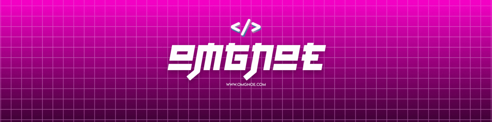

<div align="center">



<br><br>

**`digital craftsman (developer / privacy enthusiast / automation junkie)`**

<br>

[](https://tta.lu)
[](mailto:info@tta.lu)
[](https://github.com/omgnoe)

</div>

---

```js
const noe = {
    location: "Luxembourg 🇱🇺",
    currentFocus: ["MediDoc", "QuantX", "AI Grading"],
    askMeAbout: ["flutter", "privacy", "automation", "coffee"],
    funFact: "I code better after midnight ☕"
};
```

---

### 📱 on the app store

<table>
<tr>
<td width="50%" align="center">

<a href="https://apps.apple.com/lu/app/selloutai/id6751592448">

</a>
<br><br>
**🤖 SellOutAI**
<br>
AI-powered listing creator.
<br>
Snap a photo → get pro listings for eBay, Vinted & more.
<br>
<sub>Auto price estimation • Multi-language • Smart descriptions</sub>

</td>
<td width="50%" align="center">

<a href="https://apps.apple.com/lu/app/my-budget-buddy/id6745560702">

</a>
<br><br>
**💰 My Budget Buddy**
<br>
Personal finance made simple.
<br>
Track spending, manage bills, hit savings goals.
<br>
<sub>100% offline • No cloud • Your data stays yours</sub>

</td>
</tr>
</table>

---

### ⚡ shipping rn

<table>
<tr>
<td width="50%">

🔐 **EchoChat** `released`
<br>
Zero-knowledge messenger. E2E encrypted.
<br>No logs. No metadata. No bullshit.
<br>
[](https://github.com/omgnoe/echochat-anonymous-messenger-app)

</td>
<td width="50%">

🏥 **MediDoc** `building`
<br>
Medical appointments for LU/FR/DE/BE.
<br>Because healthcare shouldn't be complicated.

</td>
</tr>
<tr>
<td width="50%">

📈 **QuantX** `building`
<br>
ML-powered trading bot.
<br>Let the algorithms do the work.

</td>
<td width="50%">

🎴 **AI Grading** `building`
<br>
TCG card grading with computer vision.
<br>Know what your cards are worth.

</td>
</tr>
</table>

<sub>+ private automation tools & client work that pays the bills</sub>

---

### 🛠️ weapons of choice

<div align="center">


</div>

**leveling up:** `cybersecurity` 🛡️

---

### 📊 stats

<div align="center">


</div>

---

### 🐼 when afk

```
🌙 night owl        🎹 piano & guitar        ☕ mass caffeine consumer
```

---

<div align="center">

### 🔥 support the grind

building open-source privacy tools costs mass coffee

**SOL** `4twPuihvSABNLwDq3tvz3dFigx6X7EABBqrhfaSH4hmq`

---

*"what's there to lose? it's not gonna kill me."*


</div>
