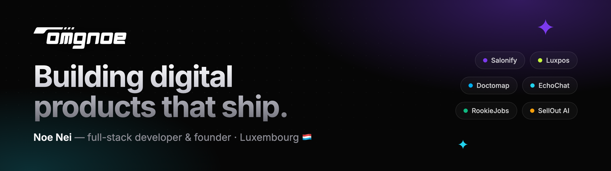

<div align="center">



<br><br>

**`full-stack developer · founder · automation & AI · Luxembourg 🇱🇺`**

<br>

[](https://omgnoe.com)
[](https://omgnoe.com/work)
[](https://github.com/omgnoe)

</div>

---

I build digital products end-to-end — web platforms, native mobile apps and AI automations — and ship them. From database, payments and infrastructure to pixel-level frontend and App Store delivery. **39+ products shipped.**

```js
const noe = {
    role: "developer & founder",
    location: "Luxembourg 🇱🇺",
    currentFocus: ["Salonify", "Luxpos", "Doctomap"],
    askMeAbout: ["next.js", "flutter", "stripe", "automation", "privacy", "ai"],
    motto: "ideas → shipped products that people actually use",
};
```

---

### 🚀 products i've built

<table>
<tr>
<td width="33%" valign="top">

**💇 [Salonify](https://salonify.eu)** `live`
<br>
Booking & POS marketplace for salons. Stripe Connect, loyalty, native apps. Live across EU & Asia.

</td>
<td width="33%" valign="top">

**🍽️ [Luxpos](https://luxpos.lu)** `live`
<br>
Modern POS for hospitality & retail. Floor plans, KDS, Tap to Pay on iPhone.

</td>
<td width="33%" valign="top">

**🏥 [Doctomap](https://doctomap.lu)** `live`
<br>
Find & book doctors in Luxembourg. Real-time availability, teleconsultation, Wazuh-monitored.

</td>
</tr>
<tr>
<td width="33%" valign="top">

**🔐 [EchoChat](https://github.com/omgnoe/echochat-anonymous-messenger-app)** `live`
<br>
Zero-knowledge messenger. E2E encrypted. No accounts, no logs, no metadata.

</td>
<td width="33%" valign="top">

**🧑‍💼 [RookieJobs](https://rookiejobs.com)** `live`
<br>
Job board for beginners. Verified beginner-friendly listings, transparent salaries.

</td>
<td width="33%" valign="top">

**🤖 [SellOut AI](https://apps.apple.com/lu/app/selloutai/id6751592448)** `live`
<br>
Snap → AI listing. Computer vision + LLM turn a photo into a pro listing in seconds.

</td>
</tr>
</table>

---

### 📱 on the app store

[](https://apps.apple.com/lu/app/selloutai/id6751592448)
[](https://apps.apple.com/lu/app/my-budget-buddy/id6745560702)

**🤖 SellOut AI** — AI-powered listings for eBay, Vinted & more · auto price estimation · multi-language
<br>
**💰 My Budget Buddy** — personal finance, fully offline · track spending, bills & savings · your data stays yours

---

### 🏢 client work

Websites, shops, back offices and POS systems delivered for brands across Luxembourg & Europe — ABSAAR, Home Center, Dynapharm (full warehouse + logistics automation: scanner picking, auto-invoicing with bank reconciliation, DHL labels), DSPImmo, BarberTruck, O2NAILS, Nexa.

➡️ **[omgnoe.com/work](https://omgnoe.com/work)**

---

### 🧪 in the lab

`QuantX` ML-powered trading bot · `AI Grading` TCG card grading with computer vision · + private automation tools

---

### 🛠️ stack

<div align="center">


<br>


</div>

**leveling up:** `cybersecurity` 🛡️

---

### 📊 stats

<div align="center">


</div>

---

<div align="center">

```
🌙 night owl        🎹 piano & guitar        ☕ runs on caffeine
```

*"what's there to lose? it's not gonna kill me."*


</div>
